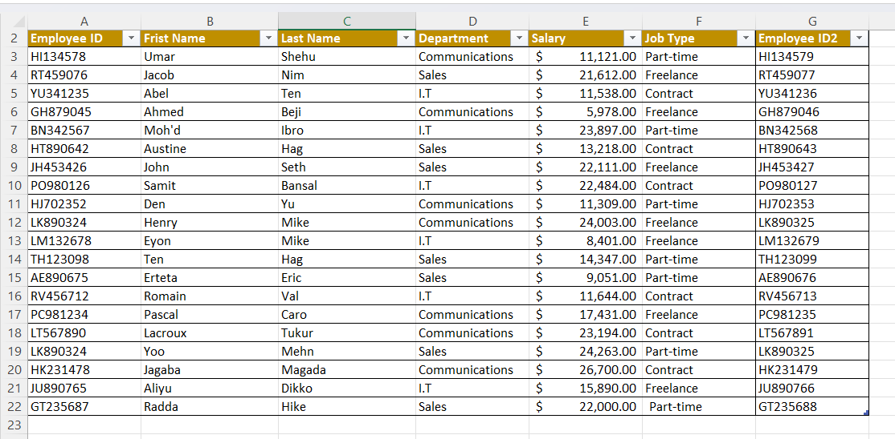
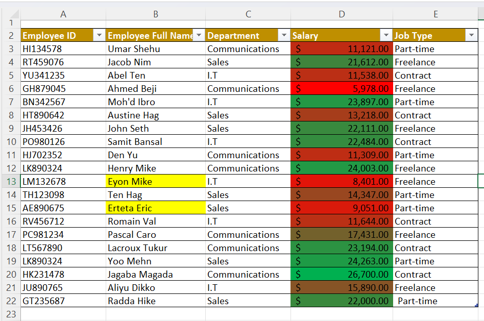
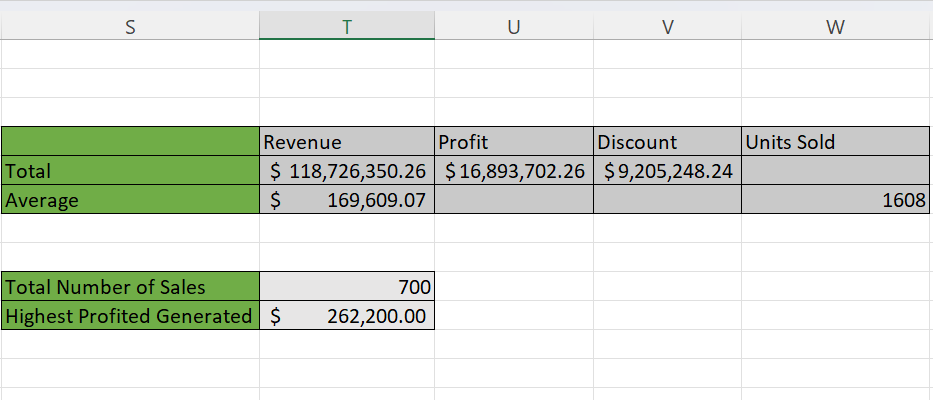

# Microsoft-Excel-Tasks
**_Disclaimer_** ⚠️- All data used for this analysis are hypothetical data generated and do not represent any company's data or an attempt to endanger their performance.
## Employee Details of "Company X"
1. First task displays employees who are freelancers earning salary above $10,0000.
2. Second task splits employees full name into first name and last name and checking for duplicate data.
3. Third task highlights employees with "E" as initials and also highlighting the highest earner (Green) and the lowest earner (Red).

**First Task**          |        **Second Task**                    |                      **Third Task**
:----------------------:|:----------------------------------------:|:------------------------------------
    |                      |
---------------------------------------------------------------------------------------------------------

## Analysing the Finances of Sales Data 
Hypothetical data analysis of Finances of "Company Y". The analysis carried out on the finances of the company are itemised below:
1. The total revenue and profit generated.
2. The average revenue and units sold for every order
3. The total discount
4. Total number of sales recorded
5. The highest profit generated
6. The sales values above average were returned "High sales" while those values lower were returned "Low sales"

Fourth Task |
:-----------|
|

## Conclusion and Recommendation
Conclusion and recommendation of the above analysis can be carried out ideally if there is a problem statement. The availabilty of problem statements gives the freedom to make suggestion, opinions, observe possible trends and also make inference based on the results obtained in the course of turning raw data into useful information.

